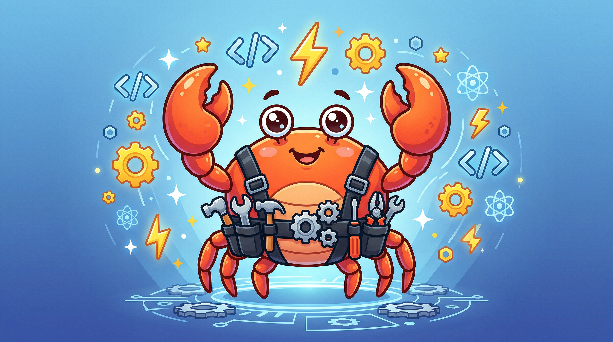
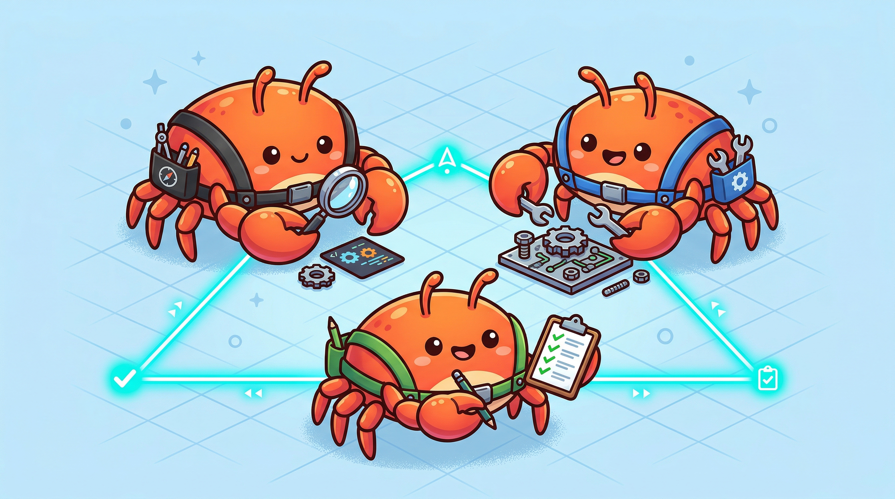

<p align="center">
  
</p>

<p align="center">
  
  <a href="LICENSE"></a>
  
  
  
  <a href="https://github.com/revfactory/jarbis/stargazers"></a>
</p>

# Jarbis

**Agent Team & Skill Architect** — A Claude Code Plugin

**English** | [한국어](README_KO.md) | [日本語](README_JA.md)

A meta-skill that designs domain-specific agent teams, defines specialized agents, and generates the skills they use.

## Overview

Jarbis leverages Claude Code's agent team system to decompose complex tasks into coordinated teams of specialized agents. Say "build a jarbis for this project" and it automatically generates agent definitions (`.claude/agents/`) and skills (`.claude/skills/`) tailored to your domain.

## Key Features

- **Agent Team Design** — 6 architectural patterns: Pipeline, Fan-out/Fan-in, Expert Pool, Producer-Reviewer, Supervisor, and Hierarchical Delegation
- **Skill Generation** — Auto-generates skills with Progressive Disclosure for efficient context management
- **Orchestration** — Inter-agent data passing, error handling, and team coordination protocols
- **Validation** — Trigger verification, dry-run testing, and with-skill vs without-skill comparison tests

## Workflow

```
Phase 1: Domain Analysis
    ↓
Phase 2: Team Architecture Design (Agent Teams vs Subagents)
    ↓
Phase 3: Agent Definition Generation (.claude/agents/)
    ↓
Phase 4: Skill Generation (.claude/skills/)
    ↓
Phase 5: Integration & Orchestration
    ↓
Phase 6: Validation & Testing
```

## Installation

### Via Marketplace

#### Add the marketplace
```shell
/plugin marketplace add revfactory/jarbis
```

#### Install the plugin
```shell
/plugin install jarbis@jarbis
```

### Direct Installation as Global Skill

```shell
# Copy the skills directory to ~/.claude/skills/jarbis/
cp -r skills/jarbis ~/.claude/skills/jarbis
```

## Plugin Structure

```
jarbis/
├── .claude-plugin/
│   └── plugin.json                 # Plugin manifest
├── skills/
│   └── jarbis/
│       ├── SKILL.md                # Main skill definition (6-Phase workflow)
│       └── references/
│           ├── agent-design-patterns.md   # 6 architectural patterns
│           ├── orchestrator-template.md   # Team/subagent orchestrator templates
│           ├── team-examples.md           # 5 real-world team configurations
│           ├── skill-writing-guide.md     # Skill authoring guide
│           ├── skill-testing-guide.md     # Testing & evaluation methodology
│           └── qa-agent-guide.md          # QA agent integration guide
└── README.md
```

## Usage

Trigger in Claude Code with prompts like:

```
Build a jarbis for this project
Design an agent team for this domain
Set up a jarbis
```

### Execution Modes

| Mode | Description | Recommended For |
|------|-------------|-----------------|
| **Agent Teams** (default) | TeamCreate + SendMessage + TaskCreate | 2+ agents requiring collaboration |
| **Subagents** | Direct Agent tool invocation | One-off tasks, no inter-agent communication needed |

<p align="center">
  
</p>

### Architecture Patterns

| Pattern | Description |
|---------|-------------|
| Pipeline | Sequential dependent tasks |
| Fan-out/Fan-in | Parallel independent tasks |
| Expert Pool | Context-dependent selective invocation |
| Producer-Reviewer | Generation followed by quality review |
| Supervisor | Central agent with dynamic task distribution |
| Hierarchical Delegation | Top-down recursive delegation |

## Output

Files generated by Jarbis:

```
your-project/
├── .claude/
│   ├── agents/          # Agent definition files
│   │   ├── analyst.md
│   │   ├── builder.md
│   │   └── qa.md
│   └── skills/          # Skill files
│       ├── analyze/
│       │   └── SKILL.md
│       └── build/
│           ├── SKILL.md
│           └── references/
```

## Use Cases — Try These Prompts

Copy any prompt below into Claude Code after installing Jarbis:

**Deep Research**
```
Build a jarbis for deep research. I need an agent team that can investigate
any topic from multiple angles — web search, academic sources, community
sentiment — then cross-validate findings and produce a comprehensive report.
```

**Website Development**
```
Build a jarbis for full-stack website development. The team should handle
design, frontend (React/Next.js), backend (API), and QA testing in a
coordinated pipeline from wireframe to deployment.
```

**Webtoon / Comic Production**
```
Build a jarbis for webtoon episode production. I need agents for story
writing, character design prompts, panel layout planning, and dialogue
editing. They should review each other's work for style consistency.
```

**YouTube Content Planning**
```
Build a jarbis for YouTube content creation. The team should research
trending topics, write scripts, optimize titles/tags for SEO, and plan
thumbnail concepts — all coordinated by a supervisor agent.
```

**Code Review & Refactoring**
```
Build a jarbis for comprehensive code review. I want parallel agents
checking architecture, security vulnerabilities, performance bottlenecks,
and code style — then merging all findings into a single report.
```

**Technical Documentation**
```
Build a jarbis that generates API documentation from this codebase.
Agents should analyze endpoints, write descriptions, generate usage
examples, and review for completeness.
```

**Data Pipeline Design**
```
Build a jarbis for designing data pipelines. I need agents for schema
design, ETL logic, data validation rules, and monitoring setup that
delegate sub-tasks hierarchically.
```

**Marketing Campaign**
```
Build a jarbis for marketing campaign creation. The team should research
the target market, write ad copy, design visual concepts, and set up
A/B test plans with iterative quality review.
```

## Built with Jarbis

### Jarbis 100

**[revfactory/jarbis-100](https://github.com/revfactory/jarbis-100)** — 100 production-ready agent team jarbises across 10 domains, available in both English and Korean (200 packages total). Each jarbis ships with 4-5 specialist agents, an orchestrator skill, and domain-specific skills — all generated by this plugin. 1,808 markdown files covering content creation, software development, data/AI, business strategy, education, legal, health, and more.

### Research: A/B Testing Jarbis Effectiveness

**[revfactory/claude-code-jarbis](https://github.com/revfactory/claude-code-jarbis)** — A controlled experiment across 15 software engineering tasks measuring the impact of structured pre-configuration on LLM code agent output quality.

| Metric | Without Jarbis | With Jarbis | Improvement |
|--------|:-:|:-:|:-:|
| Average Quality Score | 49.5 | 79.3 | **+60%** |
| Win Rate | — | — | **100%** (15/15) |
| Output Variance | — | — | **-32%** |

Key finding: effectiveness scales with task complexity — the harder the task, the greater the improvement (+23.8 Basic, +29.6 Advanced, +36.2 Expert).

> Full paper: *Hwang, M. (2026). Jarbis: Structured Pre-Configuration for Enhancing LLM Code Agent Output Quality.*

## Requirements

- [Agent Teams enabled](https://code.claude.com/docs/en/agent-teams): `CLAUDE_CODE_EXPERIMENTAL_AGENT_TEAMS=1`

## License

Apache 2.0
